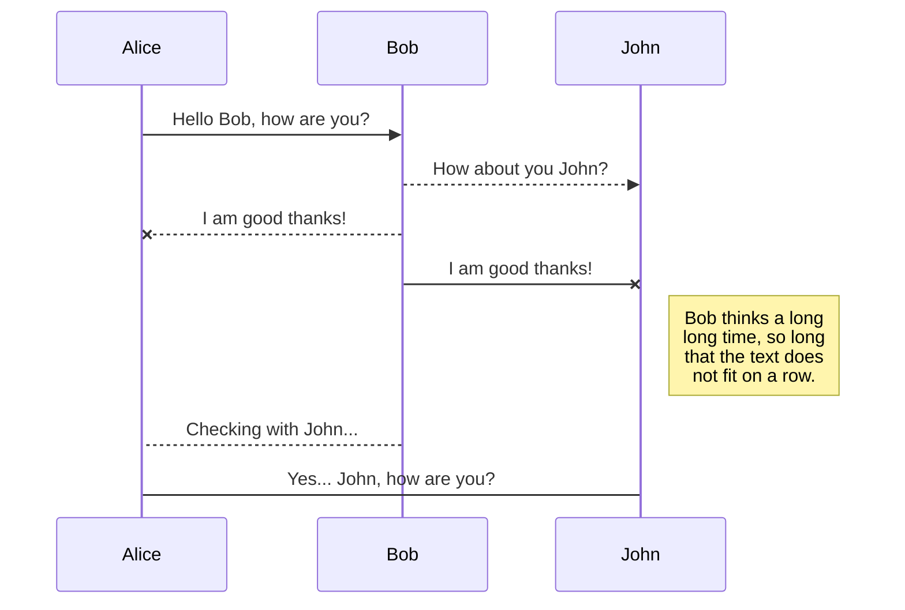
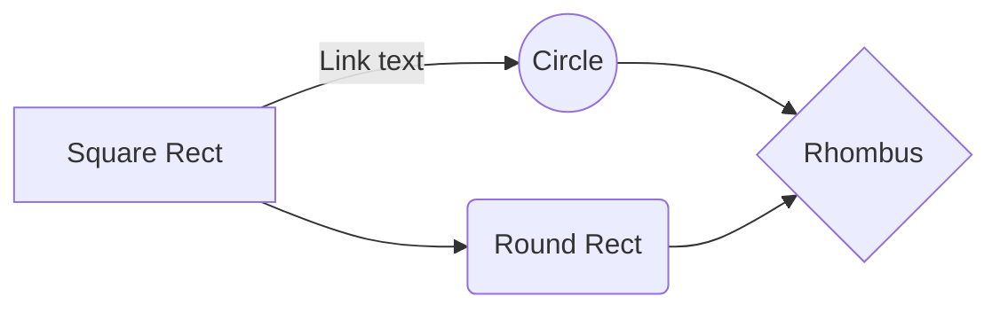

<!--
# ServeurWEB_PROJET

Find the right one is a website made to bring student together. Swipe profils of other students and match to find your godfather or godson !

Features : 
	Create a account and reset your password with swiftemailer
	Swipe through accounts
	Update your profil by changing your picture or description
	See other's students profils

Soon to be implement :
	Stay connected
	Errors management when uploading a picture

How to use our apps :

Go on the website : https://tinder.student.elwinar.com/ServeurWEB_Projet/site/accueil.html

Sign up with you mail ENT Paris Descartes and password,confirm your email adresse, log in and start to match 
-->

# Skipti + version
presentation de l'appli + pourquoi le nom skipti
# liens du site
[enter link description here](skipti.Fr)
# Architecture 
## UML diagrams

You can render UML diagrams using [Mermaid](https://mermaidjs.github.io/). For example, this will produce a sequence diagram:

And this will produce a flow chart:

# comment le faire marcher 
comment le faire marcher 
lancer la bd et le script innit par exemple
>  avoir un compte paris descartes
# Features
* login
* mail de verif 
* etc
# credit ( qui l'as fait )

